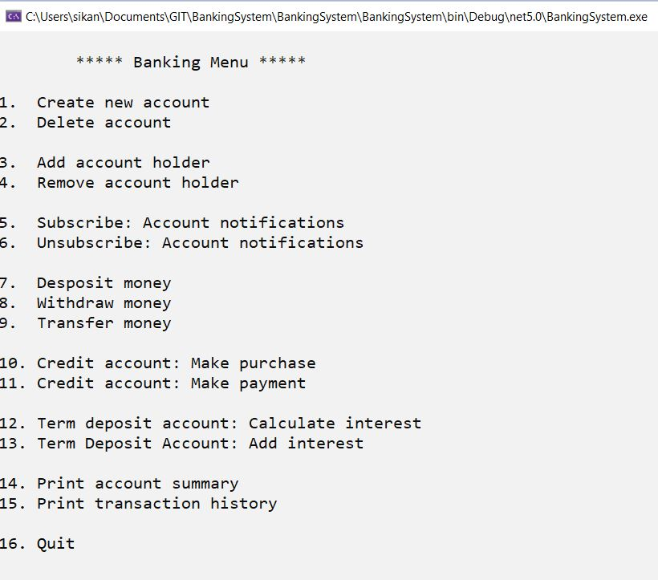
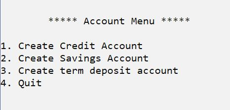

# Banking System
> A Console App developed using the .NET framework 5.0, written in C#. Current banking system functionality can be seen in the images in the [_features_](#features) section:

## Table of content
* [General Info](#general-information)
* [Technologies Used](#technologies-used)
* [Features](#features)
* [Project Status](#project-status)
* [To Do](#to-do)
* [Contact](#contact)

## General Information
* I undertook this project to develop a deeper understanding of object oriented principles, design, analysis and development.

**This project implements:**
  - _Accounts_ heirarchy with base _Account_ class and derived _SavingsAccount_, _CreditAccount_ and _TermDepositAccount_ classes.
  - _Transactions_ heirarchy with base _Transaction_ class and derived _DepositTransaction_, _WithdrawTransaction_ and _TransferTransaction_ classes.
  > Implementing these heirarchies gave me a much deeper understanding of **inheritence** and **polymorphism**. I understood, how it **reduces code, code duplicacy** and allows you to use different objects in the heirarchy, **in a uniform fashion using polymorphism**. It also **improved code readability**. 
  - Interfaces _ISubscriber_ and _IPublisher_ to **emplement observer pattern**. The observer pattern is used to provide account notifications to account holders who have subscribed for notifications.
  - Interface IListAccess. Implementation of this interface provided generic functionality to manage _Accounts_ list in the _Bank_ and _AccountHolders_ list in the _Account_ class in a **uniform manner**. It **reduced code duplication and improved readability**.
  - _Bank_ class that initializes and manages lists of: _Accounts, Transactions, Subscribers, AccountNumbers_ and provides functionality associated with these.
  - _BankingSystem_ class provides the _console Bank Menu_ and includes functionality for **serializing** and **deserializing** to preserve the state of the bank to a local xml file.
  - static _Validator_ class provides regex string validation and generic overriden methods for a variety of numeric validations.
  - Banking system consists of several _generic methods_ that have significantly **reduced code, code dupliation and improved code readability**. These methods allow objects from _Accounts_ and _Transaction_ heirarchy to be used in a uniform manner.
  - The Banking system includes complete documentation and inline comments. 

## Technologies used
- .NET framework 5.0
- C#

## Features  

  

## Project status
Project is in progress.

## To Do
- Connect to a database
- Build web app for online banking.

## Contact
Created by [_Sikander Sandhu_](https://github.com/sikandersandhu) - feel free to contact me!

 